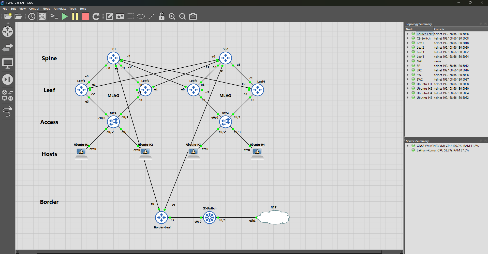

# EVPN/VXLAN Leaf-Spine Data Center Fabric
## GNS3 Lab - Production-Grade Network Engineering Portfolio

---

## Project Overview

This lab implements a full data center fabric using BGP EVPN as the control plane and VXLAN as the data plane encapsulation. The topology mirrors modern enterprise and cloud data center architectures - leaf-spine with dual-homed access layer, multi-tenant VRF segmentation, border leaf WAN peering, and BFD-driven fast failover.

The project targets three job tracks simultaneously:
- **NOC Engineer** - operational verification, failure testing, convergence measurement
- **Network Automation Engineer** - structured understanding of control/data plane state
- **Network Security Engineer** - tenant VRF isolation, segmentation validation

---

## Platform and Environment

| Component | Detail |
|---|---|
| Host OS | Windows 11 |
| Hypervisor | VMware Workstation |
| Lab Platform | GNS3 + GNS3 VM (Ubuntu) |
| GNS3 VM eth0 | 192.168.66.130 - VMnet1 management |
| GNS3 VM eth1 | 192.168.254.133 - VMnet8 NAT/internet |
| GNS3 API | 192.168.254.133:3080 |
| VMnet8 NAT Gateway | 192.168.254.2 |

---

## Node Inventory



| Node | Type | Role | AS | Loopback |
|---|---|---|---|---|
| SP1 | FRRouting Docker | Spine - underlay transit | 65000 | 10.255.0.1/32 |
| SP2 | FRRouting Docker | Spine - underlay transit | 65000 | 10.255.0.2/32 |
| Leaf1 | FRRouting Docker | VTEP - Pod-1 / Tenant-A | 65001 | 10.255.1.1/32 |
| Leaf2 | FRRouting Docker | VTEP - Pod-1 / Tenant-A | 65002 | 10.255.1.2/32 |
| Leaf3 | FRRouting Docker | VTEP - Pod-2 / Tenant-B | 65003 | 10.255.1.3/32 |
| Leaf4 | FRRouting Docker | VTEP - Pod-2 / Tenant-B | 65004 | 10.255.1.4/32 |
| Border-Leaf | FRRouting Docker | Fabric edge / external peering | 65005 | 10.255.1.5/32 |
| SW1 | Cisco i86bi-linux-l2 | Access layer - Pod-1 | - | - |
| SW2 | Cisco i86bi-linux-l2 | Access layer - Pod-2 | - | - |
| CE-Switch | Cisco i86bi-linux-l3 | WAN simulation | 65100 | 172.16.0.1/32 |
| Ubuntu-H1 | Ubuntu Docker | Host - Tenant-A VLAN10 | - | - |
| Ubuntu-H2 | Ubuntu Docker | Host - Tenant-A VLAN20 | - | - |
| Ubuntu-H3 | Ubuntu Docker | Host - Tenant-B VLAN30 | - | - |
| Ubuntu-H4 | Ubuntu Docker | Host - Tenant-B VLAN40 | - | - |

---

## Architecture Decisions

### VXLAN Mode - Per-VNI Bridge (not SVD)

The initial design used SVD (Single VXLAN Device) mode with the `external vnifilter` flags. During implementation, `vnifilter` was found to be unsupported by the iproute2 version (5.17.0) inside the FRR Docker container despite the kernel (5.15) supporting it. The `external` flag alone caused zebra to register the vxlan device as VNI 0 - preventing proper VNI state.

The final architecture uses one vxlan interface and one bridge per VNI. This is the traditional approach that works reliably across all kernel and iproute2 versions and provides identical EVPN functionality.

| VNI | Interface | Bridge | Purpose |
|---|---|---|---|
| 10010 | vxlan10010 | br10 | Tenant-A VLAN10 L2VNI |
| 10020 | vxlan10020 | br20 | Tenant-A VLAN20 L2VNI |
| 10030 | vxlan10030 | br30 | Tenant-B VLAN30 L2VNI |
| 10040 | vxlan10040 | br40 | Tenant-B VLAN40 L2VNI |
| 50010 | vxlan50010 | br100 | Tenant-A L3VNI |
| 50020 | vxlan50020 | br200 | Tenant-B L3VNI |

### Spine Role - EVPN Relay Only

Spines participate in the l2vpn evpn address-family to relay EVPN routes between leaves. They do not configure `advertise-all-vni` - that is reserved for VTEPs (leaves and border-leaf) only.

### L3VNI Association

The `vni` command under the vrf stanza in frr.conf is mandatory. Without it, zebra discovers the VXLAN interface via netlink but treats it as an L2VNI. The `show evpn vni` output will show type `L2` instead of `L3` - causing RMAC blackholing.

### Startup Order

`init.sh` must complete before FRR starts. Zebra discovers VNIs by reading kernel netlink events at startup. If the VXLAN and bridge interfaces do not exist when zebra starts, it never registers the VNIs and bgpd has nothing to advertise.

### MLAG Implementation

MLAG uses Linux bonding (802.3ad) on each leaf with a shared `ad_actor_system` MAC set via sysfs. FRR's mlag daemon was not available in this image version - Linux bonding handles LACP negotiation directly. The shared system MAC must be set via `/sys/class/net/bond0/bonding/ad_actor_system` - setting it via `ip link set bond0 address` does not update the LACP PDU system MAC.

---

## IP Addressing

### Underlay Point-to-Point Links

| Link | Subnet | Node A IP | Node B IP |
|---|---|---|---|
| SP1 ↔ Leaf1 | 10.0.1.0/30 | 10.0.1.1 | 10.0.1.2 |
| SP1 ↔ Leaf2 | 10.0.2.0/30 | 10.0.2.1 | 10.0.2.2 |
| SP1 ↔ Leaf3 | 10.0.3.0/30 | 10.0.3.1 | 10.0.3.2 |
| SP1 ↔ Leaf4 | 10.0.4.0/30 | 10.0.4.1 | 10.0.4.2 |
| SP1 ↔ Border-Leaf | 10.0.9.0/30 | 10.0.9.1 | 10.0.9.2 |
| SP2 ↔ Leaf1 | 10.0.5.0/30 | 10.0.5.1 | 10.0.5.2 |
| SP2 ↔ Leaf2 | 10.0.6.0/30 | 10.0.6.1 | 10.0.6.2 |
| SP2 ↔ Leaf3 | 10.0.7.0/30 | 10.0.7.1 | 10.0.7.2 |
| SP2 ↔ Leaf4 | 10.0.8.0/30 | 10.0.8.1 | 10.0.8.2 |
| SP2 ↔ Border-Leaf | 10.0.10.0/30 | 10.0.10.1 | 10.0.10.2 |
| Border-Leaf ↔ CE | 10.0.11.0/30 | 10.0.11.1 | 10.0.11.2 |

### MLAG Peer Links

| Link | Subnet | Node A IP | Node B IP |
|---|---|---|---|
| Leaf1 ↔ Leaf2 | 10.0.20.0/30 | 10.0.20.1 | 10.0.20.2 |
| Leaf3 ↔ Leaf4 | 10.0.21.0/30 | 10.0.21.1 | 10.0.21.2 |

### Overlay Tenant Addressing

| Tenant | VLAN | VNI | Subnet | Gateway | Host |
|---|---|---|---|---|---|
| Tenant-A | 10 | 10010 | 10.10.1.0/24 | 10.10.1.1 | H1 - 10.10.1.11 |
| Tenant-A | 20 | 10020 | 10.10.2.0/24 | 10.10.2.1 | H2 - 10.10.2.11 |
| Tenant-B | 30 | 10030 | 10.20.1.0/24 | 10.20.1.1 | H3 - 10.20.1.11 |
| Tenant-B | 40 | 10040 | 10.20.2.0/24 | 10.20.2.1 | H4 - 10.20.2.11 |

### L3VNI (Inter-Subnet Routing)

| Tenant | VRF | L3VNI | Kernel Table | VLAN ID (local) |
|---|---|---|---|---|
| Tenant-A | vrf-tenA | 50010 | 10 | 100 |
| Tenant-B | vrf-tenB | 50020 | 20 | 200 |

---

## Wiring

### Interface Naming

| Node Type | Naming Style |
|---|---|
| FRR Docker nodes | eth0, eth1, eth2, eth3 |
| Cisco IOSvL2/L3 | Ethernet0/0, Ethernet0/1 |
| Ubuntu Docker | eth0 |

### Link Table

| Node | Port | Connected To | Port |
|---|---|---|---|
| SP1 | eth0 | Leaf1 | eth0 |
| SP1 | eth1 | Leaf2 | eth0 |
| SP1 | eth2 | Leaf3 | eth0 |
| SP1 | eth3 | Leaf4 | eth0 |
| SP1 | eth4 | Border-Leaf | eth0 |
| SP2 | eth0 | Leaf1 | eth1 |
| SP2 | eth1 | Leaf2 | eth1 |
| SP2 | eth2 | Leaf3 | eth1 |
| SP2 | eth3 | Leaf4 | eth1 |
| SP2 | eth4 | Border-Leaf | eth1 |
| Leaf1 | eth2 | Leaf2 | eth2 (MLAG peer) |
| Leaf3 | eth2 | Leaf4 | eth2 (MLAG peer) |
| Leaf1 | eth3 | SW1 | Ethernet0/0 |
| Leaf2 | eth3 | SW1 | Ethernet0/1 |
| Leaf3 | eth3 | SW2 | Ethernet0/0 |
| Leaf4 | eth3 | SW2 | Ethernet0/1 |
| SW1 | Ethernet0/2 | Ubuntu-H1 | eth0 |
| SW1 | Ethernet0/3 | Ubuntu-H2 | eth0 |
| SW2 | Ethernet0/2 | Ubuntu-H3 | eth0 |
| SW2 | Ethernet0/3 | Ubuntu-H4 | eth0 |
| Border-Leaf | eth2 | CE-Switch | Ethernet0/0 |
| CE-Switch | Ethernet0/1 | Cloud-NAT | VMnet8 |
| Cloud-MGMT | VMnet1 | Ubuntu-AUTO | eth0 |

---

## Build Phases

| Phase | Scope | Key Outcome |
|---|---|---|
| 1 | IP addressing on all nodes | All underlay links pingable |
| 2 | eBGP underlay + BFD | All loopbacks reachable via ECMP |
| 3 | VXLAN + EVPN Type-2/5 + VRFs | Tenant inter-subnet routing working |
| 4 | MLAG + LACP + host IPs | End-to-end host reachability |
| 5 | Border Leaf + CE peering | External Type-5 routes in all VRFs |
| 6 | BFD failure testing | 0% packet loss across 12s outage |

---

## Verification Commands

### Underlay health
```bash
vtysh -c "show bgp summary"
vtysh -c "show bfd peers"
vtysh -c "show ip route"
ping -I 10.255.1.1 10.255.1.2   # must source from loopback
```

### EVPN control plane
```bash
vtysh -c "show evpn vni"
vtysh -c "show bgp l2vpn evpn summary"
vtysh -c "show bgp l2vpn evpn route type 2"
vtysh -c "show bgp l2vpn evpn route type 5"
vtysh -c "show vrf vni"
```

### VRF data plane
```bash
vtysh -c "show ip route vrf vrf-tenA"
ip route show table 10
ip neigh show dev br100
bridge fdb show dev vxlan50010
```

### MLAG and access layer
```bash
cat /proc/net/bonding/bond0
bridge vlan show
bridge fdb show dev bond0.10
```

### Cisco switch
```
show etherchannel summary
show lacp neighbor
show interfaces trunk
show mac address-table
```

---

## Key Debugging Lessons

| Issue | Root Cause | Fix |
|---|---|---|
| `vnifilter` unknown command | iproute2-5.17.0 too old | Remove `vnifilter`, use `external` only |
| VNI 0 in zebra | SVD `external` mode without vnifilter gives VNI 0 | Switch to per-VNI bridge architecture |
| VLAN ID 50010 invalid | VLAN IDs max at 4094 | Use VLAN 100/200 mapped to VNI 50010/50020 |
| VNI type L2 not L3 | Missing `vni` under vrf stanza in frr.conf | Add `vni 50010` under `vrf vrf-tenA` |
| BGP up but no EVPN routes | FRR started before kernel interfaces existed | Always run init.sh before service frr restart |
| STP blocking trunk VLANs | STP put Po1 in blocking state | `no spanning-tree vlan 10,20` on SW1/SW2 |
| LACP Et0/1 suspended | Leaf MLAG system-mac mismatch | Set via `ad_actor_system` sysfs, not `ip link` |
| Bridge PVID wrong | br10 had PVID 1 not 10 | Enable `vlan_filtering`, set correct pvid |
| SP loopbacks missing | No `network` statement on spines | Add `network 10.255.0.1/32` to spine BGP |
| CE `ip address` rejected | IOL L3 starts in switchport mode | `no switchport` on every routed interface |
| `RTNETLINK: Directory not empty` | init.sh re-run with existing objects | Add teardown block at top of init.sh |
| Inter-VRF forwarding failed | Linux kernel blocks cross-VRF forwarding via default-VRF interfaces | Documented limitation - production handled by ASIC |

---

## Phase 6 Results - Convergence Test

| Metric | Result |
|---|---|
| Test duration | 50 seconds / 250 probes at 200ms |
| Packet loss | 0 / 250 (0%) |
| Failure injected | Dual uplink down 12 seconds |
| BFD detection | ~900ms (300ms × multiplier 3) |
| BGP recovery | ~8 seconds |
| MLAG failover | Sub-second via Po1 bond |
| Max latency spike | 107ms during reconvergence |

Zero packet loss is achieved because MLAG keeps the access layer alive during spine uplink failure - H1 remains reachable via Leaf2's Po1 member while Leaf1's uplinks are down.

---
